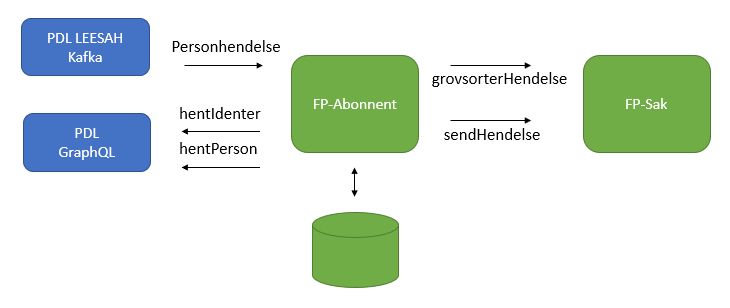

FP-Abonnent
===============
Applikasjonen tar inn hendelser fra potensielt flere kilder og videresender disse til FP-Sak, dersom aktuelle aktører har en fagsak der. Pr april 2021 er det kun lesing av fødsel, død og dødfødsel fra PDL/LEESAH Kafka topicen aapen-person-pdl-leesah-v1 som er implementert, men kjernen i applikasjonen er laget for at det skal være mulig å lese fra flere kilder i fremtiden, uten å endre noe særlig på den eksisterende koden.

### Virkemåte
* Når en hendelse mottas fra Kafka blir den oversatt til et internt format og serialisert ned som JSON i tabellen INNGAAENDE_HENDELSE i databasen.
* Alle PDL-hendelser holdes igjen minimum i én time innenfor "åpningstid", og utenfor må de vente til morgenen første påfølgende virkedag. Ventingen realiseres ved at det opprettes en ProsessTask VurderSorteringTask pr mottatt hendelse, som får "neste kjøring etter" satt til passende tidspunkt, se ForsinkelseTjeneste for detaljer. Behovet for venting innenfor åpningstid skyldes primært at gamle FREG bruker ANNULLERT+OPPRETTET for korrigeringer, og det kan være en forsinkelse imellom de to hendelsene. Vi venter utenfor åpningstid primært fordi Oppdrag ikke er tilgjengelig, og da vil det feile senere i prosessen.
* Når VurderSorteringTask kjører, slås det opp mot PDL for å verifisere at hendelsen er reflektert der, og dermed kan leveres til FP-Sak. For fødselshendelser blir også foreldrene slått opp, da selve hendelsen kun inneholder barnet. Hvis den kan leveres vil det opprettes en SorterHendelseTask, og hvis ikke blir det opprettet en ny VurderSorteringTask, såfremt hendelsen ikke er over en uke gammel - da vil den forkastes.
* SorterHendelseTask utfører "grovsortering" ved å sjekke med REST-kall om én av aktørene i hendelsen finnes i én eller flere saker i FP-Sak. Ved treff vil det opprettes en SendHendelseTask som leverer hendelsen. Hvis ikke vil hendelsen forkastes.
* SendHendelseTask leverer tilslutt hendelsen til FP-Sak, som vil bruke dette som en trigger om at "noe har skjedd", og undersøke det nærmere ved å gjøre ny registerinnhenting og opprette revurdering / oppdatere åpen behandling etter behov. FP-Sak har også mulighet til å gjøre en "finsortering" i forkant av dette, for eksempel for å sjekke om hendelsens dato treffer innenfor et angitt vindu. 

### Lokal utvikling
* For å teste applikasjonen ende-til-ende lokalt må man benytte VTP + Autotest, sammen med FP-Sak.
* I VTP finnes en REST-tjeneste /api/pdl/leesah som gir mulighet til å opprette hendelser på intern Kafka-topic. FP-Abonnent lytter på denne når den kjøres lokalt. I tillegg til å opprette hendelsen på topic, blir også endringen i hendelsen reflektert i PDL-mocken i VTP, for eksempel opprettelse av barn som følger av fødselshendelse.
* Ved lokal utvikling (og kjøring på GHA) blir ikke hendelser forsinket, mens hvis du ønsker å få hendelsen prosessert uten å vente på forsinkelsen i Q/DEV, må du sette NESTE_KJOERING_ETTER på prosesstasken til nåtid i PROSESS_TASK-tabellen.

### Henvendelser
Spørsmål knyttet til koden eller prosjektet kan rettes til:
* Jan Erik Johnsen (jan.erik.johnsen@nav.no)
* Jens-Otto Larsen (jens-otto.larsen@nav.no)
